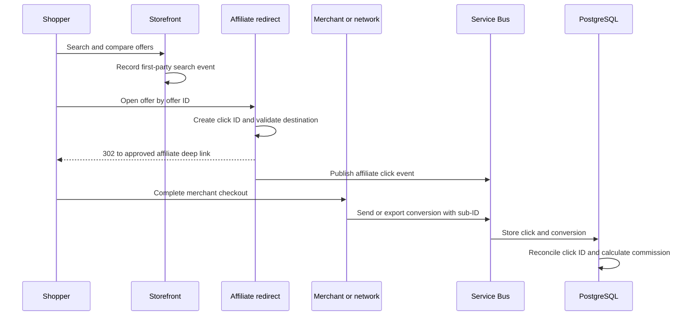
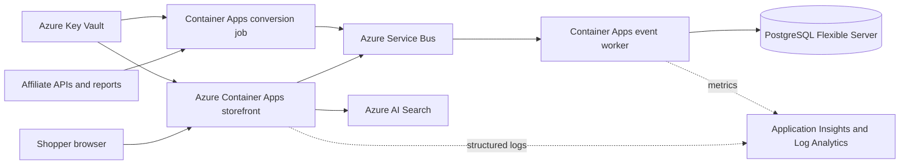

# Affiliate and Search Monetization Playbook

Date: 2026-08-27

This document is an operating plan for an India-first service, not legal, tax, accounting, or investment advice. Affiliate-network terms, advertising policies, privacy rules, commissions, cookie windows, API limits, and price-display requirements change. The founder MUST verify each current contract and applicable Indian requirements before publishing links.

## 1. What earns money

The platform SHOULD layer revenue in this order:

| Priority | Revenue stream | How it works | Launch stage | Guardrail |
|---|---|---|---|---|
| 1 | Cost-per-sale affiliate commission | A merchant pays a percentage or fixed amount after an attributed order | MVP | Recommendation rank MUST NOT be secretly determined by commission |
| 2 | Cost-per-lead affiliate commission | A permitted partner pays for a qualified signup or enquiry | After retail MVP | Regulated finance, insurance, and health leads require separate legal review |
| 3 | Sponsored search/category placement | A merchant pays CPC, CPM, or a fixed campaign fee for clearly labeled placement | After stable traffic | Label `Sponsored`; keep an organic comparison directly available |
| 4 | Display/contextual ads | An approved ad network serves ads on editorial or low-purchase-intent pages | After UX baseline | Ads MUST NOT imitate offer buttons or create layout shift |
| 5 | Price-alert newsletter sponsorship | A relevant merchant sponsors an opted-in alert or editorial issue | After consent and alerts | Separate service messages from marketing consent |
| 6 | Merchant data/reporting | Merchants buy aggregated, thresholded category insights | Growth | Never sell identifiable users or raw search histories |

Organic Google/Bing traffic does not itself pay the site. Search traffic becomes revenue when a visitor clicks a valid affiliate offer and completes the merchant's qualifying action, or when a clearly disclosed ad/sponsored result is viewed or clicked under its contract.

## 2. What works in the code today

The preview contains two first-party tracking surfaces:

1. `GET /go/[offerId]` looks up a server-owned offer, creates `clickId`, substitutes `{{click_id}}` into a configured deep link, checks HTTPS and the offer's domain allow-list, emits `affiliate_click`, and returns a no-store `302`.
2. `POST /api/events/search` receives a bounded query/category/result count, emits `catalog_search`, and returns no-store `202`.

The checked-in destinations are ordinary merchant searches. They generate no commission. A destination becomes monetized only after an approved affiliate URL overrides it through configuration or, in the production data model, through the encrypted affiliate-link record.



Console JSON is sufficient for the preview and is collected by Container Apps/Log Analytics. Before public monetization, EPIC-006 in the PRD MUST publish click and search events to Service Bus and persist normalized events in PostgreSQL. A redirect MUST still succeed when analytics is temporarily unavailable; telemetry failure MUST be observable through a metric and dead-letter workflow.

## 3. Affiliate activation, step by step

### 3.1 Establish the business

1. Establish the Indian business entity, GST/tax treatment, INR payout bank account, reporting process, and accounting owner.
2. Register a domain and business email. The domain/name MUST pass trademark and availability checks.
3. Publish real About, Contact, Affiliate Disclosure, Editorial Methodology, Privacy, Cookie, and Terms pages.
4. Replace preview products with original editorial content and permitted merchant data. Many programs reject empty, copied, or unfinished sites.
5. Keep `NEXT_PUBLIC_SITE_MODE=preview` until launch acceptance is complete.

### 3.2 Apply to programs

Apply directly to Indian merchants or networks carrying campaigns for Flipkart, Myntra, Ajio, Amazon India, and specialist book, fashion, travel, or precious-metal retailers. Also evaluate networks such as Awin, CJ, Impact, Rakuten Advertising, and Partnerize where they operate relevant Indian campaigns. This list is not an endorsement; public program availability and merchant participation MUST be verified rather than assumed.

For each program, record this policy matrix before integration:

| Field | Required decision |
|---|---|
| Program and merchant ID | Exact account/property that owns the relationship |
| Approved domains/apps | Every domain on which links may appear |
| Allowed traffic sources | SEO, email, social, paid search, browser notifications, and apps |
| Trademark bidding | Allowed, restricted, or prohibited terms |
| Deep-link format | Network redirect, direct merchant URL, signed URL, or API response |
| Intermediate redirects | Whether `/go/[offerId]` is permitted; use a direct link when prohibited |
| Sub-ID parameter | Exact field, character set, maximum length, and whether `clickId` is allowed |
| Attribution window | Click/view window and last-click or multi-touch rules |
| Price/image source | Feed/API/editorial and permitted cache lifetime |
| Required price timestamp | Exact display wording and refresh interval |
| Coupon rules | Authorized coupons only; prohibited code scraping |
| Disclosure wording | Network-specific and local-law requirements |
| Returns/reversals | Statuses and reconciliation delay |
| API/feed quotas | Rate limit, refresh frequency, and retention restrictions |
| Conversion delivery | API, webhook/postback, SFTP, or report download |
| Data deletion | Contractual deletion timetable after termination |

Large Indian marketplaces and affiliate networks can impose strict rules for price caching, availability text, images, trademarks, link rewriting, and redirect behavior. Do not assume the generic `/go` pattern is permitted for Flipkart, Myntra, Ajio, Amazon India, or any network. The link renderer MUST support direct sponsored links on a per-program basis.

### 3.3 Configure a permitted deep link

For local validation:

```dotenv
AFFILIATE_URL_OFFER_STRIDE_01=https://merchant.example/approved-product?affiliate=APPROVED_ID&subid={{click_id}}
```

The example host will be rejected unless it appears in that offer's `merchantDomains`. India launch records MUST allow only approved retailer/network redirect domains. In production, merchant domains and encrypted deep-link templates MUST come from an administrator-approved database record, not a deployment variable per product.

For Azure:

1. Put network API secrets and any confidential link templates in Azure Key Vault.
2. Give the Container App's managed identity `Key Vault Secrets User` only for the required vault scope.
3. Reference Key Vault secrets from Container Apps. Do not copy secrets into source, CI variables, images, or browser bundles.
4. Store non-secret network rules, merchant domains, campaign IDs, and feature flags in PostgreSQL or App Configuration.
5. Use workload identity federation/OIDC from CI to Azure. Do not create a long-lived service-principal secret.

### 3.4 End-to-end verification

Before enabling a merchant:

1. Open the exact offer on staging.
2. Confirm disclosure appears before or adjacent to the link.
3. Confirm the destination merchant and product are visible before clicking.
4. Confirm the browser receives `302`, `Cache-Control: private, no-store`, and the expected allow-listed host.
5. Confirm the affiliate dashboard records the click or test transaction.
6. Confirm the permitted sub-ID equals the site's `clickId` when supported.
7. Complete a network-approved test conversion where possible.
8. Import the pending conversion and reconcile it to the click.
9. Import approved, declined, and reversed statuses without double-counting revenue.
10. Disable the merchant automatically if link health, feed freshness, or policy checks fail beyond its threshold.

## 4. Click and conversion attribution

### 4.1 Required identifiers

| Identifier | Source | Purpose | Exposure |
|---|---|---|---|
| `offerId` | Catalog | Select immutable merchant offer record | URL path and event |
| `clickId` | Redirect route UUID | Join outbound click to network conversion | Network sub-ID only when permitted |
| `productId` | Catalog | Product/category reporting | Server event |
| `placement` | Server-accepted query value | Compare home, search, guide, alert, and sponsored slots | Server event |
| `campaign` | Server-accepted query value | Campaign reporting | Server event |
| Network transaction ID | Network | Deduplicate conversions and status changes | Conversion store |

Do not place email, name, IP, account ID, or a raw session token in affiliate sub-IDs. A random `clickId` is sufficient. Keep the mapping first-party and apply a documented retention period.

### 4.2 Conversion import

Each network adapter MUST:

- Authenticate with managed identity to Key Vault and use the network's supported credential.
- Pull incrementally using a watermark and periodically reconcile a wider lookback window.
- Treat the network transaction ID plus merchant/program as the idempotency key.
- Preserve original currency, gross order amount where contractually permitted, commission, status, event time, and settlement time.
- Convert reporting currency with a versioned exchange-rate source without overwriting the original amount.
- Model pending, approved, declined, locked, paid, and reversed states.
- Update status idempotently and retain an audit record.
- Send unknown sub-IDs, malformed rows, and reconciliation mismatches to a review queue.

Revenue dashboards MUST separate estimated/pending commission from approved and paid commission. Returns and network reversals MUST reduce the same reporting cohort rather than appearing as unrelated negative sales.

## 5. Monetizing on-site search

### 5.1 Affiliate-first search

The safest launch model is organic product ranking followed by affiliate checkout:

1. Azure AI Search returns matching normalized products and facets.
2. The page ranks offers using documented price, shipping, availability, seller quality, freshness, and product-match signals.
3. A shopper opens an offer through the program-permitted link mode.
4. Search query, result position, offer click, and conversion are joined in first-party reporting.

The system SHOULD optimize for conversion quality and user value, not raw click volume. A misleading click may increase CTR briefly but damages merchant approval, conversion rate, SEO, and trust.

### 5.2 Sponsored search results

After organic search is stable, add sponsored placements with these controls:

- A visible `Sponsored` label on every paid result.
- Separate campaign eligibility from organic relevance.
- Minimum relevance and in-stock/freshness thresholds.
- Frequency limits per search and user context.
- At least one clearly accessible organic comparison result.
- Logged impression, viewability, click, spend, and billing rule.
- Contracted CPC/CPM/fixed-fee terms and invalid-traffic adjustments.
- No self-serve bidding system at first; use manually approved campaigns in the admin portal.

The initial sponsored model SHOULD be a fixed weekly/category package or agreed CPC with a monthly invoice. Building an auction is unjustified at 5,000 DAU.

### 5.3 Search advertising and display ads

Azure AI Search is a catalog/search engine, not an ad network. Display or search ads require an external approved provider or direct merchant sales even though the application, data, and reporting remain hosted on Azure.

Recommended placement policy:

- Use ads on editorial guides, zero-result recovery pages, and lower-purchase-intent category content first.
- Avoid an ad above the primary comparison on mobile.
- Reserve fixed dimensions to prevent cumulative layout shift.
- Never style an ad as a merchant offer or site navigation.
- Apply consent before non-essential ad storage/access where required.
- Block sensitive-category behavioral targeting until separately reviewed.

Do not use paid-search arbitrage, trademark bidding, coupon claims, or bridge pages unless every involved affiliate and ad contract explicitly permits the practice. Search-engine quality policies can suspend both advertising and publisher accounts.

### 5.4 Use search data to grow revenue

Aggregate first-party search data supports:

- **Zero-result repair:** Add demanded products and synonyms.
- **Merchant recruitment:** Show aggregate unmet demand to potential partners.
- **Content planning:** Publish original guides for high-intent questions.
- **Merchandising:** Feature genuine price drops in high-demand categories.
- **SEO expansion:** Create valuable category/brand pages only when enough unique inventory and content exist.
- **Alert adoption:** Offer price alerts after consent for recurring high-intent searches.
- **Sponsored sales:** Sell relevant, labeled placements using aggregated volumes.

Raw personal search histories MUST NOT be sold. Merchant reports SHOULD use minimum aggregation thresholds and exclude unique or sensitive queries.

## 6. Measurement model

### 6.1 Event taxonomy

| Event | Required properties | Purpose |
|---|---|---|
| `catalog_search` | event ID, time, normalized query, category, result count | Demand and zero-result analysis |
| `search_result_impression` | search event ID, product ID, rank, organic/sponsored | Result performance and sponsor billing |
| `affiliate_click` | click ID, product ID, offer ID, merchant, placement, campaign | Outbound funnel and network join |
| `conversion_imported` | network transaction ID, click ID if supplied, status, commission, currency | Revenue attribution |
| `offer_suppressed` | offer ID, reason, actor/rule, time | Trust and policy audit |
| `feed_run_completed` | merchant, rows read/valid/changed/rejected, duration, watermark | Freshness and integration operations |

### 6.2 Core formulas

| Metric | Formula |
|---|---|
| Search CTR | Affiliate clicks from search / searches with results |
| Zero-result rate | Searches with zero results / all searches |
| Conversion rate | Approved orders / valid affiliate clicks |
| EPC | Approved commission / valid affiliate clicks |
| Revenue per session | Approved commission / eligible sessions |
| Reversal rate | Reversed commission / initially tracked commission |
| Offer freshness | Offers within merchant SLA / active offers |
| Broken-link rate | Failed active links / links checked |

Segment every metric by merchant, program, category, device class, placement, campaign, and freshness band. Do not optimize from tiny samples; dashboards MUST show sample size and status lag.

### 6.3 Attribution limitations

Affiliate reporting will not match click logs perfectly because of consent choices, cookie prevention, cross-device purchases, app handoff, last-click overwrite, ad blockers, network fraud filtering, cancellations, and delayed reversals. The dashboard MUST label attributed revenue as network-reported rather than claiming complete causal measurement.

## 7. Azure implementation path



Implementation sequence:

1. Keep current structured logs while traffic is internal.
2. Add Service Bus topic `commerce-events` with subscriptions for analytics, fraud, and reporting.
3. Publish events with duplicate-resistant IDs and short network timeouts.
4. Add a Container Apps worker that batches inserts into partitioned PostgreSQL event tables.
5. Export aged raw events to Blob Storage and delete them from the operational database per retention policy.
6. Add per-network conversion jobs and reconciliation dashboards.
7. Send product and aggregated event metrics to Azure Monitor; do not use high-cardinality raw query text as a metric dimension.
8. Create alerts for event publish failures, dead-letter count, click-volume anomaly, conversion-import delay, and zero active offers for a merchant.

## 8. Fraud and quality controls

- Application-level rate limits SHOULD constrain abusive endpoints.
- Click analytics MUST classify known bots and internal health checks separately.
- Sponsored billing MUST exclude duplicate, automated, datacenter, and contractually invalid traffic.
- The site MUST NOT click its own affiliate links automatically, use hidden frames, force redirects, or offer prohibited incentives.
- Link-check jobs MUST use a method and frequency permitted by each merchant; a HEAD request is not universally supported.
- Commission spikes, click-without-page-view spikes, impossible geographies, and repeated click IDs MUST alert an operator.
- Admin overrides MUST include actor, reason, before/after value, and timestamp.

## 9. Required launch evidence

Affiliate monetization is ready only when all are true:

- Business, country, domain, and payout identity are approved.
- At least two merchants or one merchant plus substantial original content are live, subject to program terms.
- Every link has a policy-matrix row and a successful test record.
- Disclosure is conspicuous near links and globally available.
- Privacy/consent behavior has country-specific review.
- Product data and images have documented usage rights.
- Price timestamps and stale-offer suppression meet each merchant SLA.
- `clickId` reconciliation works for networks that permit sub-IDs.
- Pending, approved, declined, and reversed conversion states are tested.
- Bot filtering and sponsor-billing rules are documented.
- Revenue dashboards distinguish estimated, approved, and paid commission.
- A kill switch can disable one merchant, program, campaign, or all outbound links.

## 10. First 90 days after launch

### Days 1-30

- Review broken links, stale offers, zero-result searches, and disclosure placement daily.
- Compare site clicks with every network dashboard and document discrepancies.
- Publish two high-quality category guides per week rather than thousands of thin pages.
- Contact merchant program managers with evidence of compliant traffic and content.

### Days 31-60

- Add the second wave of merchants in the top three converting categories.
- Launch opted-in price alerts for one category.
- Test one clearly labeled direct-sponsored package with an existing merchant.
- Improve synonyms and matching from aggregate zero-result data.

### Days 61-90

- Scale only categories that meet freshness, CTR, conversion, and content-quality thresholds.
- Add conversion API/report automation for the highest-revenue network.
- Decide whether contextual ads improve net revenue without harming affiliate conversion or Core Web Vitals.
- Produce a merchant scorecard using aggregated data, not user-level histories.

## Official starting references

- ASCI influencer advertising guidelines: https://www.ascionline.in/social-media-influencers/
- Digital Personal Data Protection Act resources: https://www.meity.gov.in/data-protection-framework
- FTC endorsements and disclosures for any applicable US-facing activity: https://www.ftc.gov/business-guidance/advertising-marketing/endorsements-influencers-reviews
- Google spam policies: https://developers.google.com/search/docs/essentials/spam-policies
- Google product structured data: https://developers.google.com/search/docs/appearance/structured-data/product
- Microsoft Advertising policies: https://about.ads.microsoft.com/en/resources/policies
- Azure Service Bus: https://learn.microsoft.com/azure/service-bus-messaging/service-bus-messaging-overview
- Azure Monitor/Application Insights: https://learn.microsoft.com/azure/azure-monitor/app/app-insights-overview
- Azure Key Vault managed identity guidance: https://learn.microsoft.com/azure/key-vault/general/authentication

These references are starting points only. The signed affiliate contract and current launch-country law control the implementation.