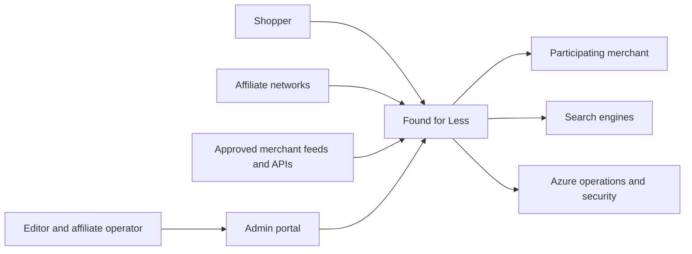
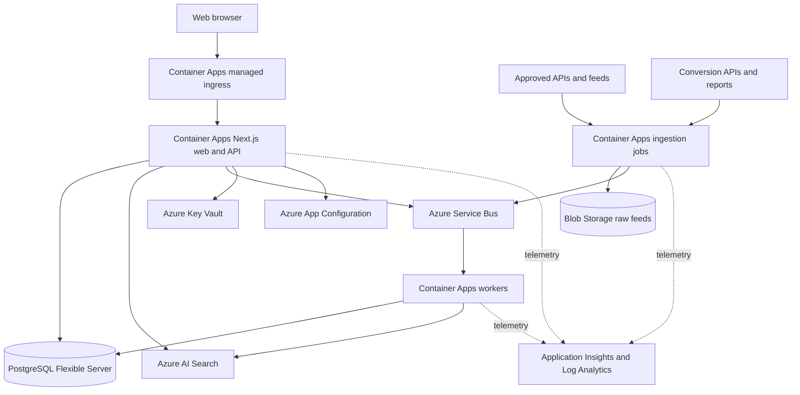
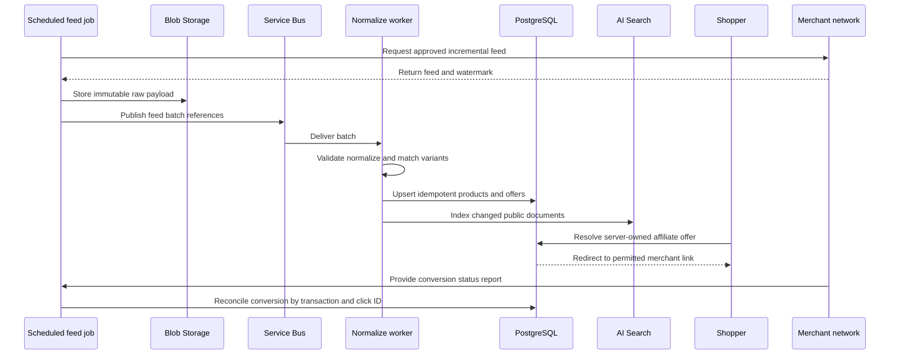
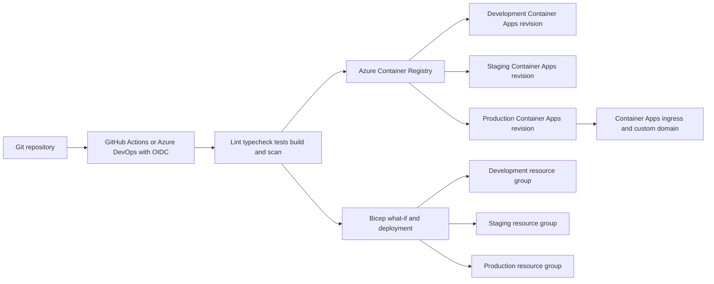

# Introduction

Found for Less is the provisional name for an independent product-discovery and price-comparison service. It will help shoppers search products across participating merchants, understand material differences between offers, and leave the site through disclosed affiliate links to complete purchases with the merchant. The platform earns commission when a network attributes a qualifying conversion.

The launch target is India with English content, INR pricing, approximately 5,000 daily active users, 100,000 normalized products, and up to 20 merchants. The design provides headroom for traffic spikes and a later path to millions of offers without starting with microservices or Kubernetes.

The customer promise MUST be “best price found among participating merchants,” never an unsupported universal “lowest price.” Every comparison MUST show merchant coverage, price-check time, shipping/fee status, and ranking methodology. The site owns discovery and attribution, while merchants own checkout, payment, inventory, delivery, returns, and warranties.

The key words "MUST", "MUST NOT", "REQUIRED", "SHALL", "SHALL NOT", "SHOULD", "SHOULD NOT", "RECOMMENDED", "MAY", and "OPTIONAL" in this document are to be interpreted as described in RFC 2119.

**Cross-reference conventions**: This document uses `FR-` for functional requirements, `NFR-` for non-functional requirements, `SEC-` for security requirements, `CON-` for constraints, `FM-` for failure modes, `AC-` for acceptance criteria, `DG-` for unresolved decision gates, and `RD-` for resolved decisions.

## Executive Summary

| Area | Plan |
|---|---|
| Product | Search-first responsive comparison experience with category hubs, product/variant pages, merchant offers, deals, price history, and original buying guides |
| Revenue | Affiliate commission first, then clearly labeled direct sponsorships, contextual ads, and opted-in alert sponsorship |
| Positioning | A transparent comparison desk that explains coverage and total cost rather than claiming omniscience |
| Azure runtime | Azure Container Apps managed ingress to Azure Container Apps running Next.js 16 as a modular monolith |
| Data | PostgreSQL Flexible Server as system of record, Blob Storage for raw feeds, Service Bus for durable work, Azure AI Search for catalog retrieval |
| Operations | Managed identities, Key Vault, App Configuration, Application Insights, Log Analytics, Azure Monitor, Defender for Cloud, Azure Policy, and Bicep |
| Availability | Single Azure region with zone resilience at launch; documented regional recovery instead of active-active multi-region |
| Delivery | Approximately 18-24 weeks to a production launch with the recommended team, preceded by affiliate approval and country selection |

## Product Vision and Business Model

**Vision:** Make shopping research calmer and more honest by combining broad discovery, category-specific comparison, and current merchant offers in one place.

**Value proposition:** One search returns normalized products and comparable offers from participating stores, with enough context to know whether a lower sticker price is genuinely a better purchase.

**Primary revenue:** Cost-per-sale and cost-per-lead commission under approved affiliate agreements. Secondary revenue MAY include visibly sponsored placements and contextual ads after organic relevance and Core Web Vitals are stable.

**Trust principles:** Coverage is disclosed, sponsorship is labeled, price evidence is timestamped, stale offers disappear, editorial judgments are documented, and commission never silently determines organic rank.

## Personas

| Persona | Need | Core journey | Success signal |
|---|---|---|---|
| Value-focused shopper | Find a competitive current offer quickly | Search, filter, compare, open merchant | Qualified outbound click without confusion |
| Research-focused shopper | Understand quality and total-cost differences | Read guide, inspect attributes, compare offers | Longer engaged session followed by confident click |
| Precious-metal buyer | Compare purity, unit, certification, fees, and reference rate | Select metal/product type, normalize units, inspect seller | No false like-for-like comparison |
| Editorial merchandiser | Curate useful collections without corrupting organic rank | Create collection, select products, publish with audit | Fresh, original, policy-compliant content |
| Affiliate operator | Keep feeds, links, and conversion imports healthy | Monitor jobs, suppress bad offer, reconcile conversion | High freshness and low broken-link rate |
| Merchant/program manager | Understand compliant traffic and attributed value | Review aggregate merchant scorecard | Approved commission and sustained partnership |

# 1. Goals and Non-Goals

- **Goal 1**: Serve a fast, accessible, search-first storefront for approximately 5,000 daily active users.
- **Goal 2**: Normalize and compare 100,000 launch products from up to 20 approved merchant programs.
- **Goal 3**: Attribute permitted outbound clicks and imported conversions without exposing personal data in affiliate sub-IDs.
- **Goal 4**: Earn affiliate revenue while maintaining truthful ranking, disclosures, price timestamps, and merchant-policy compliance.
- **Goal 5**: Acquire durable organic traffic through technically sound SEO and genuinely useful category/editorial content.
- **Goal 6**: Run application, data, security, and observability infrastructure on Azure using infrastructure as code.
- **Non-Goal 1**: The platform will not accept payment, create merchant orders, own inventory, or fulfill returns in version 1.
- **Non-Goal 2**: The platform will not scrape merchants without explicit contractual permission.
- **Non-Goal 3**: The platform will not promise the universal lowest market price.
- **Non-Goal 4**: The platform will not launch financial-product comparison as ordinary retail content.

### In Scope

- Public home, category, search, product, comparison, deal, brand, merchant, and guide experiences.
- Approved feed/API/manual content ingestion, product matching, offer freshness, and dead-link operations.
- Affiliate deep links, click IDs, conversion imports, commission status, and revenue reports.
- Admin operations for catalog quality, content, policies, merchants, and incident response.
- Azure infrastructure, CI/CD, security, backups, monitoring, and cost controls.
- India, English, and INR at launch, with schemas designed for later Indian languages and cross-border offers.

### Out of Scope (deferred)

- **On-site marketplace checkout**: Defers payment, PCI, seller-of-record, tax, fraud, fulfillment, and returns complexity.
- **Native mobile applications**: Responsive web/PWA is sufficient to validate retention and alerts.
- **Public seller self-service**: Merchant setup remains admin-controlled until policy automation is proven.
- **Personalized ranking**: Organic relevance remains explainable; account-based personalization follows consent and value validation.
- **Financial products**: Loans, cards, insurance, and investment leads require a separately owned regulated vertical.
- **Active-active multi-region**: Regional recovery is proportionate to the launch business impact.

## Decision Gates

| ID | Decision | Owner | Deadline | Blocking consequence |
|---|---|---|---|---|
| DG-001 | Confirm Indian legal entity, GST/tax treatment, payout setup, and accounting process | Founder with qualified Indian counsel/accountant | Before EPIC-002 | Blocks contracts, payouts, invoicing, and tax reporting |
| DG-002 | Validate provisional brand and acquire domain/trademark clearance | Founder | Before EPIC-003 UI freeze | Blocks production metadata, domain, and affiliate applications |
| DG-003 | Select first 3-5 affiliate programs and document each policy matrix | Affiliate Operations | Before EPIC-004 | Blocks feed adapters and production links |
| DG-004 | Choose Central India, South India, or another justified Azure primary region and the recovery region | Cloud Lead | Before EPIC-002 provisioning | Blocks IaC parameters, data residency, backup, and RTO design |
| DG-005 | Approve consent categories, analytics retention, and deletion policy | Privacy Owner | Before EPIC-006 | Blocks production event collection and advertising |
| DG-006 | Decide whether each program permits `/go` redirects and sub-IDs | Affiliate Operations | Before merchant activation | Blocks link rendering mode for that merchant |
| DG-007 | Set production launch date after affiliate approvals, not before | Founder | At beta exit | Prevents schedule pressure from bypassing program approval |

## Brand and Positioning

| Option | Strength | Risk | Disposition |
|---|---|---|---|
| Found for Less | Human, broad, does not make an absolute price claim | Domain/trademark not yet checked | Recommended provisional name |
| Price Desk | Clearly conveys comparison | Generic and potentially difficult to protect | Reserve option |
| Better Basket | Friendly and expandable | Implies cart/checkout that v1 does not own | Rejected for launch |

**Recommended descriptor:** “Compare current offers from participating stores.”

**Required disclosure near monetized links:** “Affiliate link: we may earn a commission if you buy, at no extra cost to you.” Global disclosure MUST explain that compensation does not automatically control organic ranking. Qualified Indian counsel MUST approve the final wording.

# 2. Terminology

| Term | Definition |
|---|---|
| Affiliate program | Contract governing links, tracking, content use, conversion qualification, commission, and payout |
| Canonical product | Merchant-independent representation of one product model |
| Variant | Purchasable product distinction such as size, color, storage, format, purity, or weight |
| Offer | Merchant-specific purchasable listing for an exact or explicitly qualified variant |
| Participating merchant | Merchant for which the site has approved and currently valid data/link rights |
| Best found price | Lowest comparable eligible price observed among displayed participating merchants, subject to disclosed fees |
| Landed cost | Item price plus known mandatory tax, shipping, and fees for a defined destination |
| Price observation | Immutable time-stamped record of price, currency, availability, shipping state, and source |
| Sub-ID | Affiliate-network field carrying the site's random click ID when contractually permitted |
| EPC | Approved commission divided by valid outbound clicks |
| Feed run | One incremental or full ingestion attempt for a merchant source |
| Stale offer | Offer whose last successful verification exceeds its merchant/category freshness SLA |
| Organic result | Result ranked without payment for position |
| Sponsored result | Relevant paid placement labeled before interaction |

# 3. Solution Architecture

## 3.1 Architecture Principles

1. The launch system MUST be a modular monolith for web/API behavior with independently deployable ingestion/event jobs.
2. PostgreSQL MUST own transactional truth. Azure AI Search MUST be a rebuildable retrieval index, not the source of record.
3. Raw feeds MUST land unchanged in Blob Storage before validation and normalization.
4. All asynchronous jobs MUST be idempotent, bounded, retryable, and dead-letter aware.
5. Azure-hosted code MUST authenticate to Azure services with managed identity and RBAC.
6. Secrets MUST remain in Key Vault and MUST NOT enter source, images, browser bundles, or long-lived CI credentials.
7. Public content SHOULD be statically generated or cached where truthful freshness allows. Clicks, searches, admin, and account state MUST be dynamic and no-store.

## 3.2 Azure Service Map

| Tier | Azure service | Launch configuration intent | Scale trigger |
|---|---|---|---|
| Edge | Azure DNS and Container Apps managed ingress | Managed TLS, custom domain, platform DDoS protection, application-level rate limiting | Add Front Door with WAF only when abuse, bot traffic, or multi-region routing is evidenced |
| Web/API | Azure Container Apps | Next.js standalone container, minimum 2 replicas, HTTP autoscale, zone-aware environment where supported | Raise replicas/concurrency after measured p95 saturation |
| Jobs | Azure Container Apps Jobs | Scheduled feed pulls and event-driven batch workers using same Node toolchain | Split resource profiles by network/feed duration |
| Registry | Azure Container Registry | Immutable images, retention, vulnerability scanning integration | Premium tier if private-link/geo-replication is required |
| Transactional data | Azure Database for PostgreSQL Flexible Server | General Purpose compute, zone-redundant HA, private access, backups, PgBouncer | Vertical scale, indexes, partitioning, then read replica |
| Raw/exports | Storage Account with Blob or ADLS Gen2 | ZRS, versioning, lifecycle rules, private endpoint | Cool/archive tiers and separate analytics account |
| Messaging | Service Bus Standard | Durable queues/topics, retries, duplicate controls, DLQs | Premium for predictable isolation or sustained throughput |
| Search | Azure AI Search Standard | Product index, facets, synonyms, autocomplete; replicas sized for query SLA | Add replicas for QPS and partitions for index size |
| Configuration | App Configuration | Non-secret feature flags, merchant kill switches, ranking version | Geo-replica for regional recovery |
| Secrets | Key Vault | Network/API secrets, secret-backed app configuration, soft delete and purge protection | Separate vaults by environment and ownership |
| Observability | Application Insights, Log Analytics, Azure Monitor | Traces, metrics, logs, SLO dashboards, action-group alerts | Sampling/retention tuning before adding capacity |
| Identity | Managed Identity and Microsoft Entra ID | Workload identity, admin workforce auth and MFA | Entra External ID only when shopper accounts launch |
| Cache | No distributed cache at launch | Next.js, database, and search caches first | Add Azure Managed Redis only after measured repeated hot reads |

No content delivery or web application firewall tier is purchased at launch. Container Apps provides managed TLS, custom domains, and platform DDoS protection, and the workload is a single-region India audience with no login and no payment surface. Azure Front Door with WAF MUST be revisited when bot or scraping abuse is measured, when a second region is added, or when edge caching is shown to improve Core Web Vitals.

## 3.3 System Context

## 3.4 Container View

## 3.5 Feed and Attribution Data Flow

## 3.6 Deployment View

## 3.7 Data Model

| Entity | Important fields and invariants |
|---|---|
| Product | ID, canonical title, brand ID, category ID, model identifiers, description provenance, lifecycle status, canonical slug |
| Variant | ID, product ID, normalized attributes JSON, GTIN/ISBN/MPN where licensed, exact-match fingerprint, image set |
| Category | ID, parent ID, slug, schema version, filter definitions, freshness SLA, content/indexation status |
| Brand | ID, canonical name, aliases, approved assets, merchant mappings |
| Merchant | ID, name, domains, country, quality state, shipping/return metadata, kill switch |
| AffiliateProgram | Network, merchant ID, contract dates, link mode, sub-ID rule, cookie window, feed/API policy, secret references |
| Offer | ID, variant ID, merchant ID, external listing ID, item price, currency, tax/shipping/fee states, availability, URL template reference, last checked, expiry, status |
| PriceObservation | Offer ID, observed time, item price, known landed cost, currency, availability, source run ID, immutable source hash |
| Promotion | Offer ID, authorized code/terms, start/end, eligibility, stackability, provenance |
| AffiliateLink | Offer/program ID, destination host, encrypted/template reference, mode, validation state, last link check |
| ClickEvent | Click ID, offer/product/merchant IDs, placement, campaign, event time, bot classification; no personal identifier in sub-ID |
| ConversionImport | Network transaction key, click ID when supplied, status, amount, original currency, commission, event/settlement times, import run |
| FeedRun | Source, mode, watermark, start/end, row counts, status, raw blob URI, error summary |
| DataQualityIssue | Entity, rule, severity, observed value hash, status, assignee, audit times |
| EditorialContent | Type, title, slug, author/reviewer, body, sources, disclosure, publish/review/expiry times |
| User | Deferred external identity ID, country, consent references, created/deleted times; no password storage |
| Consent | Subject reference, policy version, purpose, status, jurisdiction, captured/withdrawn times |
| Alert | Deferred user/product/query target, threshold, channel, consent reference, quiet hours, last sent |

### Canonicalization and Matching

- Exact GTIN, ISBN, MPN plus brand mappings SHOULD establish high-confidence matches.
- Variant-defining attributes MUST match exactly before prices are compared: shoe size, apparel size/color, storage, book format/edition/language, metal purity/weight/product type, and appliance model.
- Fuzzy text/embedding candidates MAY enter a review queue but MUST NOT auto-merge below the approved confidence threshold.
- Merge and split operations MUST retain aliases, provenance, before/after values, and an operator audit trail.
- Unknown shipping/tax MUST remain unknown. The system MUST NOT represent item price as landed cost.
- Currency conversion MUST preserve original currency and the rate source/version. Launch comparisons use INR; non-INR offers remain excluded until cross-border tax, duties, and conversion are implemented.
- Stale offers MUST be removed from “best found price” and search ranking after the category/program SLA.

### Initial Organic Offer Ranking

1. Exclude blocked merchant, invalid link, mismatched variant, unavailable, expired, prohibited, or stale offers.
2. Separate offers with complete landed cost from offers with unknown mandatory costs.
3. Within a comparable group, sort by landed cost or item price, then merchant quality, freshness, and deterministic offer ID.
4. Show commission-independent organic results. Sponsored placements occupy a separately labeled slot and MUST pass relevance/freshness eligibility.
5. Display “Best price found among N participating merchants” plus the count actually queried and the last-check time.

## 3.8 Information Architecture and Showcase

### Page Inventory

| Surface | Required modules |
|---|---|
| Home | Global search, category shortcuts, fresh price drops, popular comparisons, gold/silver desk, seasonal collection, original guides, methodology/disclosure |
| Search | Query, spelling/synonyms, category/brand/merchant facets, price range, availability, shipping state, sort, result count, zero-result recovery, labeled sponsor slot |
| Category hub | Category-specific filters, popular brands, current comparisons, price drops, guide links, coverage statement, updated time |
| Product page | Product identity, variant selector, image rights/provenance, key specs, offer table, landed-cost status, price history, disclosure, alternatives, methodology |
| Deals | Verified promotions and genuine observed reductions with baseline period and expiry; no fake countdowns |
| New lows | Products whose comparable observed price is lowest within a disclosed history window |
| Merchant page | Merchant description, offer count, shipping/returns summary, freshness, affiliate relationship disclosure |
| Brand page | Canonical brand products, category links, original brand context, coverage and indexability threshold |
| Editorial guide | Author/reviewer, sources, update date, comparison methodology, monetized links, related products |
| Gold/silver hub | Reference-rate source/time, unit converter, purity/product type filters, premiums/fees, certified merchant products, no-investment-advice notice |
| Saved/alerts | Local saved list in preview; consented account watchlists, thresholds, channels, and unsubscribe controls later |
| Admin | Feed health, merchant/link kill switches, product merge/split, mappings, issues, content, policy matrix, conversion reports, audit log |

### Category Showcase Matrix

| Category | Showcase and fields | Filters | Special caveat |
|---|---|---|---|
| Gold and silver | Reference rate separately from coins, bars, and jewelry; purity, weight, hallmark/certificate, mint, making charge, premium, tax, seller | Metal, 24K/22K/18K or fineness, gram/troy ounce, coin/bar/jewelry, certified, total price | Never imply jewelry and bullion are comparable; source/time required; no investment advice |
| Shoes | Brand, model, gender/unisex, use, cushioning, width, color, size availability, return policy | Activity, size, width, brand, color, material, price, merchant | Compare the exact size/variant; unavailable sizes do not establish a shopper's price |
| Clothing | Garment type, material, fit, size system, color, care, sustainability claim source | Type, size, fit, color, material, brand, price, merchant | Normalize regional size systems without claiming equivalence when brand sizing differs |
| Books | ISBN, edition, format, language, author, publisher, publication date, condition | Format, language, new/used, edition, author, price | Hardcover, paperback, ebook, audiobook, edition, and condition are separate variants |
| Electronics | Model/MPN, warranty region, connectivity, core specifications, seller status | Brand, model, specification, condition, warranty, price | Refurbished/open-box/new and marketplace seller warranty MUST remain explicit |
| Mobiles and computers | Storage, memory, processor, screen, network lock, keyboard region, OS, condition | Model, RAM, storage, CPU, carrier/unlocked, condition | Carrier plans, trade-ins, subscriptions, and device-only prices MUST not mix |
| Appliances | Model, capacity, energy rating, dimensions, installation, warranty | Type, capacity, dimensions, energy class, installation, price | Delivery, installation, removal, and regional electrical standards affect comparability |
| Home, kitchen, furniture | Dimensions, materials, assembly, room/use, finish, delivery window | Type, dimensions, material, color, brand, delivery | Large-item delivery and assembly can dominate landed cost |
| Beauty and personal care | Size/volume, ingredients, shade, skin/hair type, expiry/batch where available | Product type, concern, shade, ingredient exclusion, size, price per unit | No unsupported medical claims; authorized seller and counterfeit risk are visible |
| Health and fitness | Equipment dimensions, resistance/weight, subscription need, certifications | Activity, equipment type, size, resistance, subscription, price | Medical devices/supplements require separate claims and jurisdiction review |
| Baby, kids, toys | Age range, safety standard, material, dimensions, batteries, recall status | Age, type, safety/certification, brand, price | Recall monitoring and age/safety labeling are mandatory |
| Sports and outdoors | Sport, skill level, dimensions, material, weather rating, gender/size | Sport, use, size, rating, brand, price | Safety equipment and technical ratings require source provenance |
| Automotive accessories | Compatible make/model/year/trim, part number, installation, warranty | Vehicle compatibility, part type, brand, price | Fitment MUST be explicit; never imply universal compatibility |
| Grocery and essentials | Pack count, net quantity, unit price, dietary/allergen fields, delivery | Unit price, pack, dietary, brand, delivery | Include only where program permits; availability and local delivery change quickly |
| Software and digital services | License term, seats, platform, region, renewal, trial, cancellation | Platform, term, seats, billing period, price | Introductory and renewal prices MUST both be shown; region/license restrictions apply |
| Travel and experiences | Dates, party size, room/fare class, inclusions, cancellation, taxes/fees | Destination, dates, travelers, class, flexibility, total price | Dynamic inventory requires real-time confirmation; tourism taxes and resort fees matter |
| Financial-product leads | APR/rate, eligibility, fees, representative example, risk disclosure | Jurisdiction-specific only | Future separate regulated vertical with qualified compliance owner |
| Gifts and seasonal | Recipient/occasion, delivery deadline, personalization, stock | Occasion, recipient, budget, delivery date | Remove expired urgency and recalculate delivery cutoffs continuously |

## 3.9 UX Flows and States

**Primary flow:** Land directly on search, enter query, choose exact variant/category, scan comparable products, inspect offer table, see affiliate disclosure, open merchant, complete merchant checkout.

**Navigation:** Desktop uses visible category/deal/metals/guide navigation. Mobile uses compact icon controls, a labeled menu, reachable saved items, and horizontally scrollable cards with no body overflow.

**Required states:** Loading skeleton with stable geometry, no results with query recovery, partial merchant outage with coverage warning, stale offer suppressed, all offers unavailable, unknown shipping, link disabled, feed delayed, search degraded to PostgreSQL fallback, and affiliate tracking degraded without blocking a permitted direct destination.

**Outbound behavior:** Merchant and affiliate relationship MUST be visible before click. Links MUST use `rel="sponsored noopener noreferrer"` where applicable and MUST respect network-required direct-link behavior.

## 3.10 SEO and Content

- Next.js server rendering/static generation MUST provide crawlable category/product/editorial content.
- Canonical URLs MUST exclude tracking and non-indexable facet parameters.
- XML sitemap indexes MUST be partitioned by content type and limited to canonical, public, sufficiently complete pages.
- Robots rules MUST block admin, APIs, redirect routes, internal search combinations, and preview environments.
- `Product`, `Offer`, `AggregateOffer`, `BreadcrumbList`, `ItemList`, and `Article` structured data MUST appear only when visible content truthfully supports every property.
- Internal-search pages SHOULD remain non-indexed unless converted into curated landing pages with unique value and controlled URLs.
- Facets MUST use a documented allow-list for indexation. Duplicate, empty, and thin combinations MUST canonicalize or remain noindex.
- Merchant descriptions/images MUST comply with feed licenses and retention rules. Original editorial assets are preferred.
- Guides MUST show author/reviewer, sources, update date, methodology, and affiliate relationship.
- Google Search Console and Bing Webmaster Tools MUST monitor indexation, rich-result errors, crawl anomalies, and removals.
- Publishing SHOULD begin with depth in 3-5 categories, not thousands of auto-generated thin pages.

## 3.11 Reliability and Scaling

| Objective | Launch target |
|---|---|
| Public availability SLO | 99.9% monthly excluding declared maintenance |
| Affiliate redirect availability | 99.95% monthly, with direct-link fallback only when contractually safe |
| Search latency | p95 under 500 ms server-side at expected concurrency |
| Core Web Vitals | p75 LCP at most 2.5 s, INP at most 200 ms, CLS at most 0.1 |
| Offer freshness | At least 99% of active offers inside merchant/category SLA |
| Broken active links | Less than 0.5% over rolling 24 hours |
| Zone failure | RPO 0 for PostgreSQL HA target, RTO under 30 minutes |
| Regional disaster | RPO at most 1 hour and RTO at most 4 hours after restore procedure is proven |

Container Apps MUST scale on HTTP concurrency and queue backlog with minimum replicas that avoid cold-start risk. Workers MUST apply backpressure and batch database/search writes. PostgreSQL MUST begin with query/index review, PgBouncer, and bounded pools; add table partitioning for observations/events, then read replicas only when evidence requires them. AI Search capacity MUST be load-tested with production-like facets and indexing. Redis MUST not compensate for missing indexes or inefficient queries.

# 4. Requirements

**Summary**: The platform must combine truthful multi-category comparisons, approved affiliate integrations, strong SEO, privacy-minimized attribution, accessible UX, and production-grade Azure operations.

**Items**:

- **FR-001**: Users MUST search canonical products and filter using category-specific facets.
- **FR-002**: Users MUST compare only exact or explicitly qualified variants across eligible participating merchants.
- **FR-003**: Every offer MUST show merchant, price/currency, availability, known shipping/fees, last-check time, and affiliate disclosure.
- **FR-004**: The platform MUST label its claim “best price found among N participating merchants” and MUST NOT claim universal lowest price.
- **FR-005**: The platform MUST support per-program direct-link or allowlisted redirect mode.
- **FR-006**: Permitted redirects MUST create a random click ID and support the network's documented sub-ID field.
- **FR-007**: Search, impression, click, conversion, feed, and suppression events MUST support aggregate funnel reporting.
- **FR-008**: The system MUST import network conversions idempotently and model pending, approved, declined, paid, and reversed states.
- **FR-009**: Feed adapters MUST land raw input, validate, normalize, match, update offers, and index changed products.
- **FR-010**: Operators MUST monitor feeds/links, suppress offers, merge/split products, map categories, publish content, manage policies, and audit changes.
- **FR-011**: Gold/silver MUST separate reference rates from merchant products and normalize purity, product type, weight unit, certification, charges, and taxes.
- **FR-012**: Preview, staging, and incomplete pages MUST remain noindex.
- **FR-013**: Admin users MUST authenticate with Microsoft Entra ID, MFA, and role-based authorization.
- **FR-014**: Users MAY save products locally in MVP; server watchlists/alerts require accounts and consent in a later release.
- **FR-015**: Merchant/program kill switches MUST disable feeds, offers, campaigns, or all outbound links without redeployment.
- **NFR-001**: The service MUST meet the SLO and Core Web Vitals targets in section 3.11 at 5,000 DAU load assumptions.
- **NFR-002**: Public UX MUST meet WCAG 2.2 AA, including keyboard access, focus, reflow, contrast, labels, and reduced motion.
- **NFR-003**: Jobs and conversion imports MUST be idempotent and safe to retry with exponential backoff and jitter.
- **NFR-004**: Structured logs MUST avoid secrets and unnecessary personal data; high-cardinality query text MUST NOT become a metric dimension.
- **SEC-001**: Redirect destinations MUST come from server-owned records and pass scheme/domain validation to prevent open redirects.
- **SEC-002**: Azure service access MUST use managed identity and least-privilege RBAC.
- **SEC-003**: Secrets MUST use Key Vault with soft delete, purge protection, rotation ownership, and access logging.
- **SEC-004**: Application-level rate limiting, bot controls, dependency/container scanning, and admin MFA MUST protect public and privileged surfaces.
- **SEC-005**: Feed files MUST be size/type validated, malware scanned where applicable, parsed without executable evaluation, and quarantined on failure.
- **CON-001**: Application, first-party data, messaging, search, secrets, and observability MUST run on Azure; merchants, affiliate networks, email providers, and ad networks remain external contractual dependencies.
- **CON-002**: Version 1 MUST NOT process checkout/payment or claim ownership of merchant orders.
- **GUD-001**: Use approved APIs, feeds, editorial entries, or deep-link tools only; unapproved scraping is prohibited.
- **PAT-001**: Use a modular monolith plus separable jobs/workers until independent scaling or ownership proves a split is necessary.

## Failure Modes

| ID | Failure | Required response |
|---|---|---|
| FM-001 | Merchant feed is late or malformed | Preserve prior eligible data only inside SLA, quarantine feed, alert owner, suppress after SLA |
| FM-002 | Product matcher merges unlike variants | Stop publication for low confidence, create review issue, support audited split and reindex |
| FM-003 | Affiliate URL host is invalid/compromised | Reject redirect, return unavailable state, alert security, disable program |
| FM-004 | Service Bus unavailable during click | Do not lose permitted shopper destination; emit fallback telemetry and alert on event gap |
| FM-005 | AI Search unavailable | Serve curated/popular content and optionally bounded PostgreSQL lookup; show degraded state |
| FM-006 | Conversion import repeats report rows | Deduplicate by program/network transaction key and apply idempotent status transition |
| FM-007 | Price excludes unknown mandatory fees | Label fee unknown and keep out of complete-landed-cost group |
| FM-008 | Search engine indexes preview/facets | Default noindex, robots block, canonical controls, removal workflow, launch gate |
| FM-009 | Merchant changes affiliate policy | Kill switch program, retain audit, purge restricted data per contract, update rendering mode |
| FM-010 | Region outage | Activate documented restore/secondary deployment, verify DNS and ingress route, meet RPO/RTO |
| FM-011 | Bot traffic inflates sponsor/affiliate metrics | Classify/filter invalid traffic and reconcile sponsor billing before invoicing |
| FM-012 | Gold reference feed is stale | Remove numeric rate, show source unavailable, retain educational content without invented value |

# 5. Risk Classification

**Risk**: HIGH RISK

**Summary**: Revenue depends on external contracts, correct product matching, fresh prices, truthful claims, SEO quality, and cross-system attribution. The platform is technically moderate but commercially and operationally high risk if launched without merchant approval and governance.

**Items**:

- **RISK-001**: Affiliate programs may reject the site or change terms, eliminating inventory or commission.
- **RISK-002**: Incorrect variant matching or stale prices can mislead shoppers and breach network rules.
- **RISK-003**: Auto-generated/thin pages can fail to index or trigger search quality action.
- **RISK-004**: Commission-based bias can damage user trust and regulatory compliance.
- **RISK-005**: Precious-metal, health, travel, and financial claims carry category-specific legal risk.
- **RISK-006**: Third-party cookie loss and network attribution rules create unavoidable reporting gaps.
- **RISK-007**: Image/content licenses can require prompt removal after a program ends.
- **ASSUMPTION-001**: Launch serves India in English with INR prices; Indian-language localization follows evidence of demand.
- **ASSUMPTION-002**: Launch scope is approximately 100,000 products, 20 merchants, and 5,000 DAU.
- **ASSUMPTION-003**: Cost is flexible, but operational simplicity remains a requirement.
- **ASSUMPTION-004**: At least 3 useful categories and 2 independent merchant sources can be approved before launch.

## Risk Register

| Risk | Probability | Impact | Mitigation | Owner | Trigger |
|---|---|---|---|---|---|
| Program rejection | Medium | High | Original content, complete policies, staged applications, diversify networks | Affiliate Lead | Rejection or no response past program SLA |
| Bad match | Medium | High | Deterministic IDs, thresholds, fixtures, review queue, merge/split audit | Data Lead | Complaint or mismatch rate above 0.2% sample |
| Stale offers | Medium | High | Per-source SLA, last-known policy, automatic suppression, feed alert | Affiliate Ops | Freshness below 99% |
| SEO underperformance | Medium | High | Category depth, original guides, no thin facets, indexation dashboard | SEO Lead | Valid pages indexed below target for 4 weeks |
| Cloud spend anomaly | Low | Medium | Budgets, anomaly alerts, log caps, per-service tags and dashboards | Cloud Lead | Forecast above monthly guardrail |
| Privacy complaint | Low | High | Minimize events, consent, access/delete process, retention jobs | Privacy Owner | Complaint, regulator request, or deletion failure |
| Security incident | Low | Critical | Rate limiting, MFA, managed identity, scans, incident plan, backups | Security Lead | Defender/high-severity alert |

# 6. Dependencies

**Summary**: Contracts and country decisions precede production integrations. The technical implementation depends on approved Azure subscriptions/regions, merchant data rights, and a cross-functional launch team.

**Items**:

- **DEP-001**: Azure tenant, subscription, billing scope, DNS/domain access, and production support ownership.
- **DEP-002**: Affiliate/merchant approval, API/feed credentials, link rules, content licenses, and conversion reports.
- **DEP-003**: Launch-country legal, privacy, consumer-protection, tax, and business review.
- **DEP-004**: Node.js 22, Next.js 16, TypeScript, React 19, PostgreSQL driver/ORM selected in EPIC-003, and Azure SDK packages pinned/updated through dependency policy.
- **DEP-005**: Original editorial content, product taxonomy, category experts, image rights, and source-review workflow.
- **DEP-006**: GitHub Actions or Azure DevOps with OIDC access and protected production environment approval.

# 7. Quality & Testing

**Summary**: Quality gates cover business truth, integration contracts, security, accessibility, SEO, load, disaster recovery, and network-policy behavior, not only component correctness.

**Items**:

- **TEST-001**: Unit-test canonicalization, matching, offer eligibility/ranking, currency/unit normalization, redirects, and event validation.
- **TEST-002**: Contract-test every merchant adapter using versioned fixtures for incremental/full, malformed, duplicate, deleted, and rate-limited feeds.
- **TEST-003**: Integration-test PostgreSQL transactions, Service Bus retries/DLQ, Blob landing, Key Vault identity, and AI Search indexing.
- **TEST-004**: E2E-test search, facets, variant selection, offer comparison, disclosure, affiliate link mode, saved items, admin suppression, and zero-result recovery.
- **TEST-005**: Run automated and manual WCAG 2.2 AA tests for keyboard, screen reader, focus, reflow at 320 CSS px, contrast, zoom, and reduced motion.
- **TEST-006**: Validate responsive screenshots at representative mobile/tablet/desktop widths and verify all product media has nonzero rendered pixels.
- **TEST-007**: Validate canonical, robots, sitemap, structured data, redirects, status codes, and noindex behavior with search-engine tools.
- **TEST-008**: Run SAST, dependency/container/IaC scanning, DAST, rate-limit tests, redirect abuse, SSRF, injection, authorization, and feed bomb tests.
- **TEST-009**: Load-test expected 5,000-DAU peak model plus 3x burst for web, search, redirects, feed work, database pools, and queues.
- **TEST-010**: Inject AI Search, Service Bus, merchant API, and database failover faults; verify graceful degradation and alerts.
- **TEST-011**: Restore PostgreSQL and Blob data into isolated recovery, rebuild AI Search, and execute regional runbook quarterly.
- **TEST-012**: Perform merchant-policy checklist and founder/editorial UAT before each program activation.

### Acceptance Criteria

| ID | Criterion | Verification | Traces To |
|---|---|---|---|
| AC-001 | Search returns exact relevant fixtures with category facets and a useful zero-result state | E2E and relevance suite | FR-001 |
| AC-002 | Unlike sizes, editions, storage, condition, purity, and weights are not compared as the same variant | Matching contract tests | FR-002, FM-002 |
| AC-003 | Every offer displays required price context, disclosure, merchant count, and timestamp | E2E and content assertion | FR-003, FR-004 |
| AC-004 | Redirect rejects unknown IDs, non-HTTPS URLs, and non-allowlisted hosts; direct mode bypasses redirect where required | Unit/integration security tests | FR-005, FR-006, SEC-001 |
| AC-005 | Search-to-click and permitted click-to-conversion reports reconcile without duplicate transactions | Integration and reconciliation test | FR-007, FR-008, FM-006 |
| AC-006 | Feed retry produces one logical product/offer update and malformed batches enter quarantine/DLQ | Contract/integration tests | FR-009, NFR-003, FM-001 |
| AC-007 | Gold/silver UI cannot compare unlike product types and removes a stale reference rate | Domain tests and UAT | FR-011, FM-012 |
| AC-008 | Preview/staging return noindex and production sitemap contains only approved canonical URLs | SEO automation | FR-012, FM-008 |
| AC-009 | Every admin mutation requires authorized Entra role and creates immutable audit data | Authorization integration test | FR-010, FR-013 |
| AC-010 | Merchant/program kill switch removes affected offers/links within 60 seconds | Operational test | FR-015, FM-009 |
| AC-011 | 3x modeled burst meets latency/error targets with no exhausted connection pool | Azure load test | NFR-001 |
| AC-012 | Automated axe plus manual keyboard/screen-reader/reflow review finds no unresolved critical/serious issue | Accessibility report | NFR-002 |
| AC-013 | Managed identities access only required resources and secrets never appear in image, logs, or client bundle | RBAC review and scanning | SEC-002, SEC-003 |
| AC-014 | Zone failover and regional restore meet documented RPO/RTO in a timed exercise | Recovery evidence | NFR-001, FM-010 |
| AC-015 | Production launch checklist has owner/evidence for all policy, feed, security, SEO, and operational gates | Release audit | CON-001, GUD-001 |

# 8. Security Considerations

- **Data handling**: Minimize shopper data. Search text may be personal and MUST have restricted access, bounded retention, and redaction/deletion procedures. Do not put personal identifiers in network sub-IDs. Encrypt at rest/in transit and use private service connectivity where practical.
- **Input validation**: Validate route payload size/schema, search syntax, slugs, admin forms, feed types/counts, archive expansion, image metadata, destination URLs, and callback signatures. Use parameterized database APIs and safe parsers.
- **Access control**: Entra ID, MFA, conditional access, and least-privilege roles protect admin. Separate viewer, editor, affiliate operator, data-quality operator, and administrator permissions.
- **Secrets**: Key Vault references and managed identity only. Define rotation owner/interval for each external credential. Purge protection and diagnostic logs are REQUIRED.
- **OWASP**: Threat-model injection, broken access control, SSRF, open redirect, XSS through feeds/editorial HTML, insecure design, dependency compromise, and logging failures.
- **Edge**: Container Apps managed TLS with HTTPS/HSTS, secure headers, application-level rate limiting, platform DDoS protection, and ingress restricted to the approved custom domain.
- **Supply chain**: Lockfile builds, Dependabot/Renovate policy, SAST, SBOM, signed/provenanced images where supported, ACR/Defender scanning, and promotion by digest.
- **Backups**: PostgreSQL PITR/geo-backup decision, Blob soft delete/versioning, IaC-restorable stateless services, quarterly restore drill, and documented encryption/key dependencies.
- **Incident response**: Severity model, on-call owner, merchant/network notification contacts, evidence retention, credential rotation, link kill switch, customer/regulator communication decision tree, and post-incident review.
- **Retention/deletion**: Decision DG-005 MUST assign click/search/conversion/audit retention and deletion. Financial/audit records MAY require different lawful retention from behavioral analytics.

## Compliance and Policy Deliverables

- Affiliate Disclosure, Editorial Methodology, Privacy Notice, Cookie Notice/Preferences, Terms, Contact/About, Accessibility statement, and merchant relationship explanation.
- FTC endorsement guidance or launch-country equivalent, consumer price/advertising law, GDPR/ePrivacy/CCPA/DPDP applicability, email/SMS consent, and data-subject workflows.
- Per-network policy matrix for traffic sources, redirects, deep links, price/image caching, trademarks, coupons, email, paid search, attribution, and termination deletion.
- Clear statement that merchant owns price confirmation, payment, delivery, returns, and warranty.
- No fake reviews, fabricated popularity, fake stock, false countdowns, hidden sponsorship, or unsupported savings baseline.
- Financial leads and health claims require separately qualified review. Gold/silver content MUST not be framed as individualized investment advice.

# 9. Deployment & Rollback

1. Bicep MUST define dev, stage, and prod with separate resource groups, identities, secrets, data, budgets, and DNS names.
2. CI MUST run lint, typecheck, tests, production build, dependency/SAST/container/IaC scans, and Bicep what-if.
3. CI MUST authenticate through OIDC, build one immutable image, push by digest, and promote the same artifact.
4. Database changes MUST use expand/migrate/contract sequencing and backward-compatible revisions.
5. Container Apps MUST deploy a zero-traffic revision, pass health/smoke checks, receive canary traffic, then increase traffic while SLOs are observed.
6. Rollback MUST move traffic to the previous compatible revision. A migration MUST have a tested forward repair or rollback strategy before deployment.
7. Feed adapters, merchants, ranking versions, redirects, sponsorships, alerts, and production indexing MUST each have independent feature flags/kill switches.
8. Ingress configuration MUST accept traffic only on the approved custom domain over HTTPS.

## Indicative Cost Bands

These are planning bands, not quotes. Azure region, currency, egress, AI Search replicas/partitions, PostgreSQL HA/backup storage, log volume/retention, support, and negotiated reservations can change totals. Validate selected SKUs in the Azure Pricing Calculator before procurement.

| Stage | Indicative monthly Azure band | Main drivers |
|---|---:|---|
| Lean private MVP | ₹25,000-₹85,000 | Small Container Apps footprint, development PostgreSQL, basic search capacity, light logs, no production HA |
| Recommended production around 5,000 DAU | ₹80,000-₹3 lakh | Two web replicas, PostgreSQL HA, production AI Search replicas, Service Bus, storage, monitoring and backups |
| Growth to millions of offers/higher traffic | ₹4.25 lakh-₹21 lakh+ | Search partitions/replicas, larger HA database/read replicas, feed compute, event volume, egress, retention and DR |

FinOps controls MUST include tags, budgets at 50/75/90/100%, anomaly alerts, per-environment dashboards, Log Analytics daily caps/retention review, Blob lifecycle tiers, autoscale ceilings, orphan cleanup, reservation review after stable utilization, and monthly unit costs per active user, million searches, million offers, and $1,000 approved commission.

# 10. Resolved Decisions

| ID | Decision | Rationale |
|---|---|---|
| RD-001 | Use “best price found among participating merchants” | Accurate under incomplete market coverage and supports trust |
| RD-002 | Use Next.js TypeScript modular monolith on Container Apps | SEO/SSR plus one deployable codebase at medium scale |
| RD-003 | Use Container Apps Jobs for feeds/conversion imports | Shared container/toolchain and support for scheduled/event-driven workloads |
| RD-004 | Use PostgreSQL as source of truth and AI Search as rebuildable index | Strong relational integrity plus capable search/facets |
| RD-005 | Use Container Apps managed ingress and no edge WAF at launch | Single-region audience with no login or payment surface does not yet justify the fixed cost; revisit on measured abuse or multi-region need |
| RD-006 | Keep Redis out of launch baseline | CDN, application caching, PostgreSQL, and AI Search should be measured first |
| RD-007 | Support redirect and direct affiliate link modes | Network contracts differ; one hard-coded approach is unsafe |
| RD-008 | Start single-region with zone resilience and tested restore | Meets medium-site needs without active-active data complexity |
| RD-009 | Separate reference metal rates from products | Prevents false comparison of spot value and retail product total |
| RD-010 | Default preview/staging to noindex | Prevents sample/thin content entering search indexes |
| RD-011 | Launch for India in English with INR prices | Matches the confirmed primary audience while preserving later localization |

# 11. Alternatives Considered

| Alternative | Pros | Cons | Decision |
|---|---|---|---|
| Azure Kubernetes Service | Maximum orchestration control | High operational burden and no launch requirement | Rejected until workload/team complexity demands it |
| Many microservices | Independent deploy/scale | Distributed data, tracing, contracts, and staffing overhead | Rejected in favor of modular monolith plus jobs |
| Azure Static Web Apps only | Simple and inexpensive | Server redirects, SSR, ingestion, and dynamic data need additional runtime boundaries | Rejected for primary runtime |
| App Service | Mature Node hosting | Less natural fit for job/event scaling than Container Apps | Viable fallback, not selected |
| Cosmos DB as primary store | Elastic document model | Product/offer/conversion relationships and reporting favor relational integrity | Rejected |
| PostgreSQL full-text search only | Fewer services | Weaker facets, autocomplete, synonyms, relevance operations at target catalog | Rejected for production search, retained as degraded fallback option |
| Azure Functions for all ingestion | Strong event ecosystem | Large/long merchant feeds and shared tooling fit container jobs better | Rejected as default; MAY handle small webhooks later |
| Active-active multi-region | Highest regional availability | Complex consistency, cache, database, search, and cost | Deferred until business SLO requires it |
| Universal `/go` link redirect | Simple centralized tracking | Some affiliate contracts may prohibit masking/intermediate redirects | Rejected; use per-program link mode |

# 12. Files

- **FILE-001**: `src/app/storefront.tsx` — search-first preview UI and first-party search event producer.
- **FILE-002**: `src/data/catalog.ts` — typed demonstration categories, products, offers, and merchant allow-lists.
- **FILE-003**: `src/app/go/[offerId]/route.ts` — secure preview affiliate redirect and click event.
- **FILE-004**: `src/app/api/events/search/route.ts` — bounded search analytics intake.
- **FILE-005**: `src/app/api/health/route.ts` — liveness response.
- **FILE-006**: `Dockerfile` and `.dockerignore` — standalone non-root production container.
- **FILE-007**: `infra/` — Bicep modules and environment parameters delivered in EPIC-002.
- **FILE-008**: `src/server/catalog/` — PostgreSQL product/offer repositories delivered in EPIC-003.
- **FILE-009**: `src/workers/feeds/` — adapter pipeline delivered in EPIC-004.
- **FILE-010**: `src/server/search/` — Azure AI Search indexing/query implementation delivered in EPIC-005.
- **FILE-011**: `src/workers/attribution/` — durable events/conversion reconciliation delivered in EPIC-006.
- **FILE-012**: `src/app/admin/` — protected operational portal delivered in EPIC-007.

# 13. Simplicity Rationale

- **Scope justification**: Every epic traces to product discovery, affiliate revenue, data quality, compliance, Azure operation, or production launch. The prototype is one Next.js application. Only feeds and asynchronous event processing are separate because they have fundamentally different scheduling, retry, and resource needs.
- **Abstractions check**: Merchant feed/link/conversion adapters are required because contracts and schemas vary. Repositories isolate PostgreSQL transactions. Search indexing is isolated because AI Search is rebuildable. No general plugin platform, event-sourcing framework, or public merchant SDK is planned.
- **Configuration check**: Merchant/program/link-mode kill switches satisfy FR-005 and FR-015. Ranking version supports auditable changes. Environment separation and launch indexing mode satisfy FR-012. No speculative user-personalization flags are included.
- **Could this be simpler?**: A static page with hard-coded affiliate links would launch faster but cannot provide trustworthy freshness, product/variant matching, conversion reconciliation, operational suppression, or scalable SEO. The selected modular monolith is the smallest architecture that responsibly supports the requested business at 5,000 DAU; AKS, microservices, active-active regions, and Redis remain deferred.

# 14. Implementation Plan

Statuses describe the repository as of 2026-08-27. Estimates are engineering effort and exclude affiliate-network approval waiting time.

- **EPIC-001: Validate proposition and complete interactive preview** — Traces to FR-001 through FR-007, FR-011, FR-014, NFR-002.

| Task | Description | Status | Estimate / Owner | Acceptance / rollback | Relevant Files |
|---|---|---|---|---|---|
| ITEM-001 | Implement responsive search-first preview, category filters, sorting, saved view, truthful sample labels, and metals education | Done | 4 days / Frontend | Browser checks at 390 and 1440 px; remove feature by reverting preview component | `src/app/storefront.tsx`, `src/app/globals.css` |
| ITEM-002 | Implement typed sample catalog and safe merchant offer model | Done | 1 day / Full-stack | Strict build passes; replace fixture provider when database launches | `src/data/catalog.ts` |
| ITEM-003 | Implement allowlisted click redirect, click ID, and structured event | Done | 1 day / Backend | Known offer 302, unknown 404, blocked host 503; disable offer env override | `src/app/go/[offerId]/route.ts` |
| ITEM-004 | Implement bounded search event endpoint and debounced producer | Done | 1 day / Full-stack | 202/400/413/422 contract checks; feature can stop sending without affecting search | `src/app/api/events/search/route.ts`, `src/app/storefront.tsx` |
| ITEM-005 | Resolve DG-001 through DG-003 with documented evidence | Not Started | 1-3 weeks / Founder | Signed decision record; no technical rollback | `docs/decisions/` |

- **EPIC-002: Provision Azure foundation and delivery pipeline** — Depends on DG-001 and DG-004; traces to CON-001, SEC-002 through SEC-004, NFR-001.

| Task | Description | Status | Estimate / Owner | Acceptance / rollback | Relevant Files |
|---|---|---|---|---|---|
| ITEM-006 | Author Bicep for identity, ACR, Container Apps with custom domain and managed TLS, Key Vault, monitoring, budgets, and environment separation | Not Started | 2 weeks / Cloud | Bicep lint/build and dev what-if pass; delete dev RG only through approved teardown | `infra/main.bicep`, `infra/modules/` |
| ITEM-007 | Add OIDC CI with checks, SBOM/scans, image digest promotion, and protected production approval | Not Started | 4 days / DevOps | Pipeline promotes same digest through stage/prod; roll back Container Apps traffic | `.github/workflows/ci.yml`, `.github/workflows/deploy.yml` |
| ITEM-008 | Configure dashboards, alerts, action groups, Defender, Policy, budgets, and runbook links | Not Started | 4 days / Cloud/SRE | Synthetic alert reaches on-call; revert individual policy assignment if blocking | `infra/modules/monitoring.bicep`, `docs/runbooks/` |

- **EPIC-003: Implement product and merchant system of record** — Depends on EPIC-002; traces to FR-002 through FR-004, FR-010, FR-011.

| Task | Description | Status | Estimate / Owner | Acceptance / rollback | Relevant Files |
|---|---|---|---|---|---|
| ITEM-009 | Define PostgreSQL schema/migrations for catalog, offers, observations, programs, issues, and audit | Not Started | 1 week / Backend/Data | Migration forward/backward rehearsal on stage; expand-contract rollback | `src/server/db/`, `migrations/` |
| ITEM-010 | Implement repositories, transactions, PgBouncer-safe pools, and fixture seed | Not Started | 1 week / Backend | Integration tests prove constraints and idempotent upserts; fixture provider flag remains | `src/server/catalog/`, `src/server/db/` |
| ITEM-011 | Implement canonicalization, variant fingerprints, match confidence, and merge/split audit | Not Started | 2 weeks / Data/Backend | Category fixture suite meets false-match threshold; low confidence goes to review | `src/server/matching/`, `src/server/catalog/` |

- **EPIC-004: Build approved merchant ingestion** — Depends on DG-003 and EPIC-003; traces to FR-009, GUD-001, NFR-003, SEC-005.

| Task | Description | Status | Estimate / Owner | Acceptance / rollback | Relevant Files |
|---|---|---|---|---|---|
| ITEM-012 | Implement raw Blob landing, source manifest, hash, watermark, and lifecycle | Not Started | 4 days / Data | Same payload hash is not processed twice; disable source schedule | `src/workers/feeds/landing/`, `infra/modules/storage.bicep` |
| ITEM-013 | Implement adapter contract and first 2 merchant adapters with rate limits, retries, and fixtures | Not Started | 2 weeks / Integrations | Full/incremental/malformed/rate-limit contract tests pass; merchant kill switch | `src/workers/feeds/adapters/`, `test/fixtures/merchants/` |
| ITEM-014 | Implement Service Bus batching, worker, poison/DLQ workflow, offer expiry, and feed health | Not Started | 1 week / Backend/SRE | Retry is idempotent and DLQ alert actionable; stop job and preserve last eligible data inside SLA | `src/workers/feeds/`, `infra/modules/messaging.bicep` |

- **EPIC-005: Deliver production catalog search and SEO pages** — Depends on EPIC-003/004; traces to FR-001 through FR-004, FR-011, FR-012, NFR-001/002.

| Task | Description | Status | Estimate / Owner | Acceptance / rollback | Relevant Files |
|---|---|---|---|---|---|
| ITEM-015 | Define AI Search index, analyzers, synonyms, facets, suggesters, and incremental indexer | Not Started | 1 week / Search | Relevance fixtures and indexing SLA pass; rebuild from PostgreSQL | `src/server/search/`, `infra/modules/search.bicep` |
| ITEM-016 | Implement search/category/product/merchant/brand/deal pages and exact variant comparison | Not Started | 2 weeks / Web | E2E, accessibility, responsive, and stale-state tests pass; route flags disable unfinished pages | `src/app/search/`, `src/app/products/`, `src/app/categories/` |
| ITEM-017 | Add metadata, canonical/facet policy, robots, sitemap indexes, truthful schemas, and indexation monitor | Not Started | 1 week / SEO/Web | schema validators and preview noindex tests pass; `public-indexing` flag remains off | `src/app/robots.ts`, `src/app/sitemap.ts`, `src/server/seo/` |

- **EPIC-006: Make attribution and revenue reporting durable** — Depends on DG-005/006 and EPIC-002/003; traces to FR-005 through FR-008, SEC-001, NFR-004.

| Task | Description | Status | Estimate / Owner | Acceptance / rollback | Relevant Files |
|---|---|---|---|---|---|
| ITEM-018 | Publish click/search/impression events to Service Bus with fallback metrics and bot classification | Not Started | 1 week / Backend | Redirect remains inside latency SLO during bus fault; `durable-events` flag can disable publishing | `src/server/events/`, `src/app/go/`, `src/app/api/events/` |
| ITEM-019 | Implement per-program direct/redirect renderer, signed callback validation, and link health | Not Started | 1 week / Affiliate/Backend | Every policy mode has contract test and kill switch | `src/server/affiliate/`, `src/components/affiliate/` |
| ITEM-020 | Implement first conversion adapter, reconciliation, currency/status model, and commission dashboard | Not Started | 2 weeks / Integrations/Data | Duplicate and reversal scenarios reconcile exactly; pause import watermark safely | `src/workers/attribution/`, `src/app/admin/revenue/` |

- **EPIC-007: Build protected admin and operations** — Depends on EPIC-003/004/006; traces to FR-010, FR-013, FR-015.

| Task | Description | Status | Estimate / Owner | Acceptance / rollback | Relevant Files |
|---|---|---|---|---|---|
| ITEM-021 | Add Entra workforce auth, MFA policy dependency, roles, and authorization tests | Not Started | 1 week / Security/Web | Unauthorized/role matrix tests pass; emergency break-glass documented | `src/server/auth/`, `src/app/admin/` |
| ITEM-022 | Add feed/link health, suppression, mappings, product merge/split, policies, and audit views | Not Started | 2 weeks / Full-stack | Each mutation has role check/audit and takes effect inside 60 seconds | `src/app/admin/`, `src/server/admin/` |
| ITEM-023 | Add content workflow, disclosure versions, scheduled review/expiry, and reports | Not Started | 1 week / CMS/Web | Draft/review/publish/expire workflow and schema tests pass | `src/app/admin/content/`, `src/server/content/` |

- **EPIC-008: Complete editorial, legal, and merchant launch content** — Depends on DG-001/002/003/005; traces to FR-003/004/011/012, GUD-001.

| Task | Description | Status | Estimate / Owner | Acceptance / rollback | Relevant Files |
|---|---|---|---|---|---|
| ITEM-024 | Publish required policy/methodology/company pages after qualified review | Not Started | 2 weeks / Legal/Product | Versioned approvals and visible disclosures; keep public indexing disabled if incomplete | `src/app/policies/`, `content/policies/` |
| ITEM-025 | Produce original launch guides and category copy for 3-5 approved verticals | Not Started | 4-6 weeks / Editorial | Source/review/date/disclosure present and content quality review passes | `content/guides/`, `content/categories/` |
| ITEM-026 | Configure Search Console, Bing Webmaster Tools, analytics consent, and indexation dashboards | Not Started | 3 days / SEO/Privacy | Ownership verified and test URL inspected; disable tags via consent flag | `src/server/seo/`, `infra/modules/monitoring.bicep` |

- **EPIC-009: Harden reliability, security, and recovery** — Depends on EPIC-002 through 008; traces to all NFR, SEC, and FM items.

| Task | Description | Status | Estimate / Owner | Acceptance / rollback | Relevant Files |
|---|---|---|---|---|---|
| ITEM-027 | Execute security threat model, penetration testing, rate-limit tuning, SBOM and remediation | Not Started | 2 weeks / Security | No unresolved critical/high launch finding; revert an individual control with approval | `docs/security/`, `infra/modules/ingress.bicep` |
| ITEM-028 | Load test 1x and 3x model, tune autoscale/pools/search, and validate graceful degradation | Not Started | 1 week / Performance/SRE | AC-011 and queue recovery pass; roll back scale settings | `tests/load/`, `infra/` |
| ITEM-029 | Run zone failover, backup restore, AI Search rebuild, and regional recovery exercise | Not Started | 1 week / SRE/Data | Timed evidence meets RPO/RTO; no launch until repeatable | `docs/runbooks/disaster-recovery.md`, `infra/` |

- **EPIC-010: Beta and production launch** — Depends on all prior launch epics; traces to AC-015.

| Task | Description | Status | Estimate / Owner | Acceptance / rollback | Relevant Files |
|---|---|---|---|---|---|
| ITEM-030 | Run internal then invited beta with sample/live data boundaries and daily issue review | Not Started | 2 weeks / Product/QA | Exit metrics approved; rollback to preview/noindex and disable links | `docs/launch/beta-report.md` |
| ITEM-031 | Complete launch checklist, canary deployment, network click tests, and production indexing switch | Not Started | 3 days / Release Team | All checklist evidence signed; move traffic to previous revision and noindex |
| ITEM-032 | Operate 72-hour launch watch and publish incident/metric review | Not Started | 3 days / SRE/Product | SLO, freshness, links, indexation, clicks and spend healthy | `docs/launch/launch-review.md` |

## Team and Timeline

Recommended core team: product/founder, product designer, two full-stack engineers, backend/data engineer, cloud/SRE engineer, QA automation engineer, SEO/editorial lead, affiliate operations manager, and part-time security/privacy/legal specialists.

| Phase | Calendar range | Outcome |
|---|---|---|
| Discovery and affiliate applications | Weeks 1-3 | Country/brand/program decisions and credible preview |
| Azure foundation and core data | Weeks 2-6 | Environments, CI/CD, PostgreSQL schema, identity/monitoring |
| Feeds, matching, and search | Weeks 5-10 | Two merchant adapters, normalized catalog, AI Search |
| Storefront and SEO surfaces | Weeks 7-12 | Production pages, comparison, structured data controls |
| Attribution, admin, and policy | Weeks 10-15 | Durable events, first conversion import, operator controls |
| Content, hardening, and recovery | Weeks 12-18 | Original launch content, security/load/restore evidence |
| Beta and production | Weeks 19-24 | Invited beta, affiliate verification, canary launch |

Affiliate approvals may extend calendar time without increasing engineering effort. Do not substitute unauthorized scraping or links to preserve a date.

## Go-Live Checklist

- [ ] DG-001 through DG-007 have owner-approved evidence.
- [ ] Indian entity/GST/payout setup, domain, TLS, DNS, production metadata, and brand review are complete.
- [ ] At least the approved launch merchant set has fresh feeds and verified links.
- [ ] Every merchant policy matrix and direct/redirect mode is reviewed.
- [ ] Policies, disclosures, methodology, consent, returns/warranty wording, and contact channels are live.
- [ ] Sample products/rates and preview banners are removed from production.
- [ ] Product/variant matching sample has passed quality threshold.
- [ ] Stale, unavailable, prohibited, and invalid-link offers suppress automatically.
- [ ] Search, product, category, deals, metals, guide, and error states pass E2E/accessibility/visual tests.
- [ ] Canonicals, robots, sitemaps, schemas, and webmaster ownership pass validation.
- [ ] Rate limiting, ingress restriction, MFA/RBAC, Key Vault, scans, and incident contacts pass security review.
- [ ] Load, failover, restore, queue/DLQ, and AI Search rebuild tests have timed evidence.
- [ ] Click/sub-ID and pending/approved/declined/reversed conversion flows reconcile for each live network.
- [ ] Dashboards, SLOs, freshness/link/revenue alerts, budgets, and on-call routes are active.
- [ ] Previous Container Apps revision and public-indexing kill switch are verified.

## 30/60/90-Day Plan

| Window | Product and growth | Operations and revenue |
|---|---|---|
| Days 1-30 | Repair zero results, publish two strong guides weekly, improve top-query relevance | Daily feed/link/reconciliation review, document attribution gaps, tune rate limits and alert noise |
| Days 31-60 | Add merchants only in top converting categories, beta one consented price-alert vertical | Automate highest-value conversion import, test one labeled direct-sponsored package |
| Days 61-90 | Expand categories that meet content/freshness/conversion thresholds | Decide on contextual ads from controlled test, optimize unit economics and retention |

## Success Metrics

| Metric | First 90-day target or decision rule |
|---|---|
| Offer freshness | At least 99% inside source SLA |
| Broken active links | Below 0.5% rolling 24 hours |
| Zero-result search rate | Baseline in beta, then reduce by 25% without irrelevant results |
| Search-to-affiliate CTR | Establish by category; improve without increasing bounce/complaints |
| Approved conversion rate and EPC | Report by merchant with network status lag and sample size |
| Core Web Vitals | Meet NFR-001 at p75 |
| Organic indexation | At least 90% of submitted eligible canonical pages indexed after expected crawl period, investigated by cohort |
| Trust | Fewer than 0.2% sessions produce price/mismatch complaints; every complaint sampled and resolved |
| Cloud efficiency | Monthly Azure cost per DAU and per approved commission reviewed, not optimized at expense of SLO/trust |

# 15. Change Log

- **2026-08-27 / 1.0**: Initial comprehensive product, monetization, and Azure implementation plan. Marks the interactive preview, click redirect, search event intake, container packaging, and local validation as completed; production data and Azure provisioning remain planned.

## Official References

Policies, product behavior, API versions, and prices change. Validate these official sources during implementation:

- Azure Well-Architected Framework: https://learn.microsoft.com/azure/well-architected/
- Managed identities: https://learn.microsoft.com/entra/identity/managed-identities-azure-resources/overview
- Azure Container Apps ingress and custom domains: https://learn.microsoft.com/azure/container-apps/ingress-overview and https://learn.microsoft.com/azure/container-apps/custom-domains-managed-certificates
- Azure Container Apps: https://learn.microsoft.com/azure/container-apps/overview
- Azure Container Apps Jobs: https://learn.microsoft.com/azure/container-apps/jobs
- PostgreSQL Flexible Server: https://learn.microsoft.com/azure/postgresql/flexible-server/overview
- Azure Service Bus: https://learn.microsoft.com/azure/service-bus-messaging/service-bus-messaging-overview
- Azure AI Search: https://learn.microsoft.com/azure/search/search-what-is-azure-search
- Azure Key Vault: https://learn.microsoft.com/azure/key-vault/general/overview
- Azure Monitor and Application Insights: https://learn.microsoft.com/azure/azure-monitor/overview and https://learn.microsoft.com/azure/azure-monitor/app/app-insights-overview
- Azure Retail Prices API and Pricing Calculator: https://learn.microsoft.com/rest/api/cost-management/retail-prices/azure-retail-prices and https://azure.microsoft.com/pricing/calculator/
- Google product structured data: https://developers.google.com/search/docs/appearance/structured-data/product
- Google canonical guidance: https://developers.google.com/search/docs/crawling-indexing/consolidate-duplicate-urls
- ASCI influencer advertising guidelines: https://www.ascionline.in/social-media-influencers/
- India Digital Personal Data Protection resources: https://www.meity.gov.in/data-protection-framework
- FTC endorsements/disclosures for any applicable US-facing activity: https://www.ftc.gov/business-guidance/advertising-marketing/endorsements-influencers-reviews
- Schema.org Product and Offer: https://schema.org/Product and https://schema.org/Offer

The Azure Best Practices tool informed the managed-identity, Key Vault, least-privilege, encryption, retry, monitoring, caching, pooling, and batch-processing requirements. The Cloud Architect endpoint was attempted twice on 2026-08-27 but returned no recorded architecture result; this document does not claim its endorsement. Exact Azure pricing was not queried because region and SKU decisions remain behind DG-004.